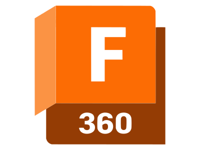
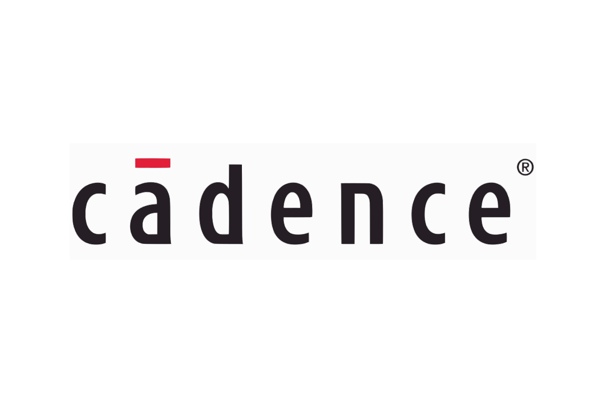

<iframe src="https://giphy.com/embed/KX5nwoDX97AtPvKBF6" width="100%" height="100%" style="position:absolute" frameBorder="0" class="giphy-embed" allowFullScreen></iframe>

<h1 align="center">Hi 👋, I'm Sreeram</h1>
<h3 align="center">I'm an undergrad in my sophomore year pursuing electronics and communication at SSN College of Engineering, Tamil Nadu, India. Highly interested in STEM and actively like to contribute to problem statements requiring a multi-disciplinary approach.</h3>

  

- 🔭 I’m currently working on **Project Pravega**

- 🌱 I’m currently learning **Hardware Description Languages**

- 💬 Ask me about **Digital System Design**

- 📫 How to reach me **vgpsreeram@gmail.com**

<h3 align="left">Connect with me:</h3>

<h3 align="left">Languages and Tools:</h3>

                  
   

&nbsp;

